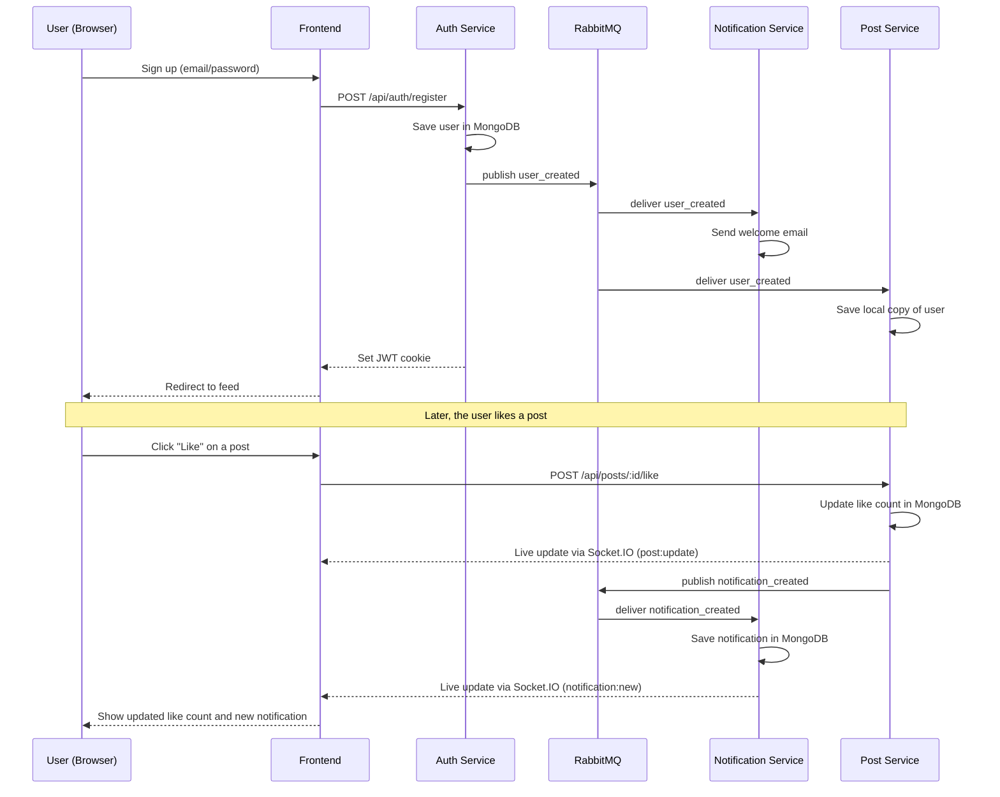

# VerbaScope

VerbaScope is a social platform where people can sign up, build a profile, share posts, follow each other, and interact in real time through likes, comments, shares, and notifications.

The project is built as a set of small backend services (a "microservices" setup) plus one frontend application. Each service has one job, and they talk to each other over HTTP and through a message queue (RabbitMQ). This README gives you the big picture. Each service also has its own README with more detail if you want to dig deeper.

## What's in this project

| Service | What it does | Port |
|---|---|---|
| **Frontend** | The website people actually use — login, feed, profiles, live updates | 3002 |
| **Auth Service** | Handles sign up, login, Google sign-in, user profiles, and follow/unfollow | 3000 |
| **Post Service** | Handles posts, likes, comments, shares, and recommendations | 3003 |
| **Notification Service** | Sends emails and delivers in-app notifications in real time | 3001 |

## How it all fits together

Think of it like this:

1. A user opens the **Frontend** and logs in. The frontend talks to the **Auth Service** to check who they are.
2. Once logged in, the frontend loads the feed from the **Post Service** — posts, likes, comments, shares.
3. When something happens that a user should know about (someone liked their post, for example), the **Post Service** tells the **Notification Service** about it through RabbitMQ, and the **Notification Service** pushes a live update to the frontend using Socket.IO, and/or sends an email.
4. All the pieces share the same login session, since it's based on a secure cookie set by the Auth Service.

In short: **Auth** handles "who are you", **Post** handles "what did you post and how did people react", and **Notification** handles "let the user know what happened". The **Frontend** ties all three together into one app.

## Architecture Diagram

```mermaid
flowchart TB
    User[User's Browser]

    subgraph Frontend["Frontend (Next.js) - port 3002"]
        FE[React App + Socket.IO Client]
    end

    subgraph Auth["Auth Service - port 3000"]
        AuthAPI[Express API]
        AuthDB[(MongoDB - Users)]
    end

    subgraph Post["Post Service - port 3003"]
        PostAPI[Express API + Socket.IO Server]
        PostDB[(MongoDB - Posts, Comments, Pulse)]
    end

    subgraph Notification["Notification Service - port 3001"]
        NotifAPI[Express API + Socket.IO Server]
        NotifDB[(MongoDB - Notifications)]
        Email[Gmail SMTP]
    end

    MQ{{RabbitMQ}}
    ImageKit[(ImageKit - Avatars & Post Images)]
    Google[Google OAuth]

    User --> FE
    FE -- HTTP --> AuthAPI
    FE -- HTTP --> PostAPI
    FE -- HTTP --> NotifAPI
    FE -. Socket.IO .-> PostAPI
    FE -. Socket.IO .-> NotifAPI

    AuthAPI --> AuthDB
    AuthAPI --> ImageKit
    AuthAPI --> Google

    PostAPI --> PostDB
    PostAPI --> ImageKit

    NotifAPI --> NotifDB
    NotifAPI --> Email

    AuthAPI -- publish user_created --> MQ
    PostAPI -- publish post/comment/like events --> MQ
    MQ -- consume user_created --> PostAPI
    MQ -- consume user_created --> NotifAPI
    MQ -- consume notification_created --> NotifAPI
```

## Data Flow Diagram

The diagram below shows a typical journey: a user signs up, then later likes someone else's post.



## Tech Stack (shared across the project)

- **Node.js + Express** for all backend services
- **MongoDB + Mongoose** for data storage
- **RabbitMQ** for services to send events to each other (e.g. "a new user signed up")
- **Socket.IO** for real-time updates (likes, comments, notifications) without refreshing the page
- **JWT stored in an HTTP-only cookie** for login sessions across all services
- **ImageKit** for storing uploaded images (avatars and post photos)
- **Next.js + React + TypeScript** for the frontend

## Project Layout

```
verbascope/
├── services/
│   ├── auth-service/         # Sign up, login, profiles, follow/unfollow
│   ├── post-service/         # Posts, likes, comments, shares, recommendations
│   ├── notification-service/ # Emails and in-app notifications
│   └── frontend/             # The Next.js website
```

Each folder is its own independent app with its own `package.json`, `.env` file, and `npm` scripts.

## Getting Started

You'll need each service running at the same time for the full app to work. A typical order is:

1. **Start MongoDB and RabbitMQ** locally (or point the `.env` files to hosted versions).
2. **Auth Service** — handles logins, so start this first.
3. **Notification Service** — listens for events like new signups.
4. **Post Service** — depends on users existing, so start after Auth.
5. **Frontend** — connects to all three services above.

For each service:

```bash
cd services/<service-name>
npm install
npm run dev
```

Each service needs its own `.env` file (see below). Once everything is running, open the frontend at `http://localhost:3002`.

## Environment Variables

Each service has its own `.env` file. Here's a quick summary of what each one needs — see each service's README for the full list.

**Auth Service** (`services/auth-service/.env`)
```env
MONGO_URI=your_mongodb_connection_string
JWT_SECRET=your_jwt_secret
GOOGLE_CLIENT_ID=your_google_client_id
GOOGLE_CLIENT_SECRET=your_google_client_secret
GOOGLE_CALLBACK_URL=http://localhost:3000/api/auth/google/callback
RABBITMQ_URI=amqp://localhost
IMAGEKIT_PUBLIC_KEY=your_imagekit_public_key
IMAGEKIT_PRIVATE_KEY=your_imagekit_private_key
IMAGEKIT_URL_ENDPOINT=https://ik.imagekit.io/your_instance
CLIENT_URL=http://localhost:3002
```

**Post Service** (`services/post-service/.env`)
```env
MONGO_URI=your_mongodb_connection_string
JWT_SECRET=your_jwt_secret
RABBITMQ_URI=amqp://localhost:5672
PORT=3003
CLIENT_URL=http://localhost:3002
IMAGEKIT_PUBLIC_KEY=your_imagekit_public_key
IMAGEKIT_PRIVATE_KEY=your_imagekit_private_key
IMAGEKIT_URL_ENDPOINT=https://ik.imagekit.io/your_instance
```

**Notification Service** (`services/notification-service/.env`)
```env
MONGO_URI=your_mongodb_connection_string
JWT_SECRET=your_jwt_secret
RABBITMQ_URI=amqp://localhost
EMAIL_USER=your_gmail_address
EMAIL_PASS=your_gmail_app_password
PORT=3001
```

**Frontend** (`services/frontend/.env.local`)
```env
NEXT_PUBLIC_AUTH_API_URL=http://localhost:3000
NEXT_PUBLIC_NOTIFICATION_API_URL=http://localhost:3001
NEXT_PUBLIC_POST_API_URL=http://localhost:3003
NEXT_PUBLIC_AUTH_URL=http://localhost:3000
```

> **Important:** The `JWT_SECRET` value must be the same across Auth, Post, and Notification services — this is what lets a single login cookie work across all of them.

## Core Features

- **Accounts:** Email/password sign up and login, plus Google sign-in
- **Profiles:** Bio, headline, avatar uploads, and viewing other users' profiles
- **Social graph:** Follow and unfollow other users
- **Posts:** Create posts with up to 4 images, view a feed, view posts by user
- **Engagement:** Like, comment (with replies), and share posts
- **Recommendations:** Suggested users to follow based on shared interests, plus trending hashtags
- **Notifications:** Real-time in-app notifications and welcome emails
- **Live updates:** New likes, comments, shares, and notifications appear instantly without a page refresh

## How the services talk to each other

- **HTTP requests** — the frontend calls each backend service directly for things like logging in, loading the feed, or updating a profile.
- **RabbitMQ (events)** — backend services notify each other when something important happens, without needing to wait on each other directly. For example:
  - Auth Service publishes a `user_created` event when someone signs up.
  - Notification Service listens for `user_created` and sends a welcome email.
  - Post Service listens for `user_created` too, so it can keep a local copy of user info for the feed.
  - Post Service publishes a `notification_created` event when something happens (a like, a comment, etc.), and the Notification Service turns that into a real notification.
- **Socket.IO (real-time)** — the Post and Notification services push live updates straight to the browser, so users see new likes, comments, and notifications without refreshing.

## A Note on Local Development

This project is set up for local development first. A few things to keep in mind:

- If RabbitMQ isn't running, most services will still start, but real-time and notification features will be limited.
- The frontend currently disables image optimization and ignores some TypeScript build errors, purely to make local development smoother. This should be revisited before a production deployment.
- Each service should be started separately, and MongoDB/RabbitMQ should be available before starting the backend services.

## Individual Service Documentation

For full details on API endpoints, folder structure, and scripts, see each service's own README:

- Auth Service README — services/auth-service/README.md
- Post Service README — services/post-service/README.md
- Notification Service README — services/notification-service/README.md
- Frontend README — services/frontend/README.md