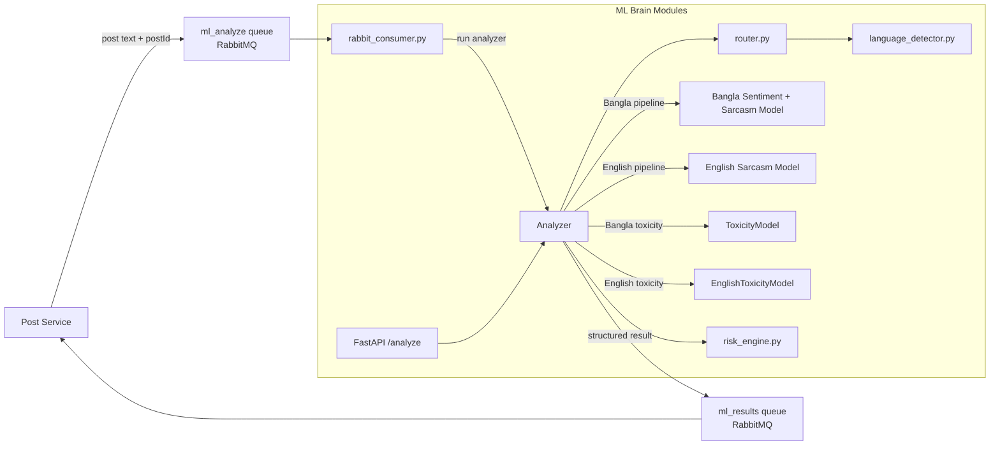

# VerbaScope ML Brain

The ML Brain is the Python machine-learning service for VerbaScope. It analyzes text for sentiment, sarcasm, toxicity, and risk in Bengali and English. It provides both an HTTP API and a RabbitMQ consumer for asynchronous inference and moderation scoring.

## Responsibilities

- Detect the language of incoming text and route it to the correct model pipeline.
- Run Bengali and English sentiment and sarcasm inference.
- Score toxicity and assign a moderation risk signal.
- Publish ML results back to the post service through RabbitMQ.
- Expose a lightweight health check and direct analysis endpoint for local debugging and integration tests.

## Architecture Diagram



## Directory And File Guide

```text
ml-brain/
├── main.py
├── model_architecture.py
├── inspect_model.py
├── rabbit_consumer.py
├── requirements.txt
├── README.md
├── models/
│   ├── __pycache__/
│   ├── english_sarcasm.py
│   ├── english_sentiment.py
│   ├── sentiment_sarcasm.py
│   ├── toxicity.py
│   └── ...
├── routing/
│   ├── language_detector.py
│   └── router.py
├── risk/
│   └── risk_engine.py
├── evaluation/
│   ├── evaluate.py
│   ├── evaluation_dataset.csv
│   ├── evaluation_metrics.py
│   ├── results.csv
│   └── confusion_matrix.png
├── test_model.py
├── test_sentiment.py
├── test_toxicity.py
├── test_sentiment_sarcasm.py
├── test_english_sentiment.py
├── test_english_sarcasm.py
├── test_long_bangla.py
├── test_pipeline.py
├── test_risk_engine.py
├── .env                  # Local configuration; do not commit secrets
├── .venv/                # Local virtual environment; generated
├── __pycache__/          # Python bytecode cache; generated
└── ...
```

### Root files and folders

| Path | Purpose |
| --- | --- |
| `main.py` | Creates the FastAPI app, loads the text-analysis models, starts the RabbitMQ consumer in a background thread, and defines `/health` and `/analyze`. |
| `model_architecture.py` | Defines the multilingual model architecture and shared feature layers used by the Bengali sentiment/sarcasm pipeline. |
| `rabbit_consumer.py` | Connects to RabbitMQ, consumes `ml_analyze` jobs, runs inference, publishes `ml_results`, and handles job acknowledgements. |
| `inspect_model.py` | Utility script for debugging model structure and outputs during development. |
| `requirements.txt` | Lists Python dependencies for FastAPI, transformers, PyTorch, dotenv, and RabbitMQ integration. |
| `README.md` | This file. |

### `models/`

| Path | Purpose |
| --- | --- |
| `models/sentiment_sarcasm.py` | Bengali sentiment and sarcasm wrapper using a BanglaBERT-based pipeline. |
| `models/english_sentiment.py` | English sentiment wrapper. |
| `models/english_sarcasm.py` | English sarcasm wrapper. |
| `models/toxicity.py` | Toxicity regression model used to estimate harmful or risky content. |

### `routing/`

| Path | Purpose |
| --- | --- |
| `routing/language_detector.py` | Detects whether input is Bengali, English, or mixed/unknown and returns confidence scores. |
| `routing/router.py` | Routes incoming text to the correct language-specific analysis flow. |

### `risk/`

| Path | Purpose |
| --- | --- |
| `risk/risk_engine.py` | Converts model outputs into a moderation risk bucket such as green/yellow/red or equivalent app-level risk signals. |

### `evaluation/`

| Path | Purpose |
| --- | --- |
| `evaluation/evaluate.py` | Runs the full model pipeline across the dataset and writes computed predictions to `results.csv`. |
| `evaluation/evaluation_metrics.py` | Produces classification reports and confusion-matrix style evaluation metrics for thesis analysis. |
| `evaluation/evaluation_dataset.csv` | Evaluation dataset with labeled Bengali/English samples and signal metadata. |
| `evaluation/results.csv` | Output generated by the evaluation pipeline. |

## Requirements And Setup

- Python 3.10+ recommended.
- Access to the Hugging Face model cache or internet to download model assets on first run.
- A reachable RabbitMQ broker for the asynchronous job queue.
- A working virtual environment or local Python environment prepared from `requirements.txt`.

Install dependencies:

```bash
python -m pip install -r requirements.txt
```

## Environment Variables

The service reads configuration from `.env` when available, and the RabbitMQ consumer expects a connection string that matches the platform setup.

| Variable | Required | Description |
| --- | --- | --- |
| `RABBITMQ_URL` | Yes for queue jobs | RabbitMQ broker URL used by the consumer. |
| `MODEL_PATH` or equivalent runtime config | Depends on the local setup | Used when the environment overrides model loading paths. |
| `PORT` | No | Optional FastAPI port override when running locally. |

## Running The Service

Start the HTTP service:

```bash
python main.py
```

The service initializes the language detector, sentiment/sarcasm models, and toxicity model on startup, then starts a background RabbitMQ consumer.

### Health check

```bash
curl http://localhost:8000/health
```

Typical response:

```json
{
  "status": "ok",
  "model_loaded": true
}
```

### Text analysis endpoint

```bash
curl -X POST "http://localhost:8000/analyze" \
  -H "Content-Type: application/json" \
  -d '{"text": "This is a very toxic and sarcastic message."}'
```

The endpoint accepts text and returns language detection plus model outputs such as sentiment, sarcasm, toxicity, and risk.

## RabbitMQ Integration

The ML Brain listens on RabbitMQ and consumes jobs from the `ml_analyze` queue.

- It reads job payloads from the queue and processes the submitted text.
- It detects language automatically and routes to the relevant model.
- It computes sentiment, sarcasm, toxicity, and risk output.
- It publishes the result to the `ml_results` queue for downstream services such as post-service.
- Failed jobs are negatively acknowledged without requeueing.

## Language Routing

- The language detector decides whether the input is Bengali, English, or mixed/unknown.
- The router picks the correct model pipeline for the detected text.
- Mixed or unknown input is handled conservatively and routed to the best available inference path.

## Model Pipeline

### Multilingual language detection and routing

Text is first processed by the language detector to decide which model family to use. This supports both Bangla and English inputs while keeping the moderation pipeline consistent across languages.

### Sentiment and sarcasm (Bengali)

The Bengali pipeline uses a BanglaBERT-based sentiment and sarcasm model. It loads trained weights and threshold files and returns both the class label and probability information.

### Sentiment and sarcasm (English)

The English pipeline loads separate English sentiment and sarcasm models and applies the same high-level risk workflow to English text.

### Toxicity

The toxicity model performs a regression-based toxicity score and is used as part of the moderation decision. The score is normalized into the app's risk-aware range.

### Risk rules

A risk engine combines the text analysis output into a final moderation signal. The exact bucket depends on the configured thresholds and the scoring logic in `risk/risk_engine.py`.

## Evaluation Pipeline

The `evaluation/` folder contains scripts and datasets for model validation and thesis evaluation.

- `evaluate.py` runs the full pipeline against the evaluation dataset.
- `evaluation_metrics.py` summarizes results into classification metrics and confusion-style visuals.
- `results.csv` stores predictions and supporting analysis output.

To run evaluation:

```bash
python evaluation/evaluate.py
python evaluation/evaluation_metrics.py
```

## Running The Checks

These are executable scripts, not a `pytest` suite. They are designed to validate a model run and the pipeline behavior directly.

```bash
python test_model.py
python test_pipeline.py
python test_risk_engine.py
python test_sentiment.py
python test_toxicity.py
python test_sentiment_sarcasm.py
python test_english_sentiment.py
python test_english_sarcasm.py
python test_long_bangla.py
```

## Dependencies

| Package | Purpose |
| --- | --- |
| `fastapi` | HTTP interface for local analysis and health checks |
| `transformers` | Tokenizers and model wrappers |
| `torch` | Deep-learning inference |
| `pika` or `amqplib` | RabbitMQ messaging support |
| `python-dotenv` | Local environment loading |
| `pandas` / `numpy` | Evaluation and matrix operations |

## Operational Notes

- The first run can be slow because model checkpoints and tokenizers are fetched from Hugging Face.
- Inference is CPU-based by default unless a GPU setup is added manually.
- The service treats model inference as a prediction layer, not as absolute truth.
- The delivery path is designed for moderation support and downstream platform integration rather than standalone human review.

## External Models

### Bengali models

- BanglaBERT-based sentiment/sarcasm pipeline
- Bengali toxicity model used for moderation scoring

### English models

- English sentiment model
- English sarcasm model

## Project Status

This service is part of the VerbaScope social platform and is actively used for automated content moderation signals and post analysis. It is designed to support both direct HTTP requests and asynchronous queue-driven inference from the wider backend.

## TO RUN THE SERVER

```bash
.\.venv\Scripts\Activate.ps1

then 


uvicorn main:app
```

## If you really want auto-reload during development

```bash
pip install watchdog
```

```to test models
python tests/test_pipeline.py

Then run the app with a watcher or the framework you prefer for local development. The core service still runs through `main.py` and the RabbitMQ consumer is started as part of bootstrapping.
  
